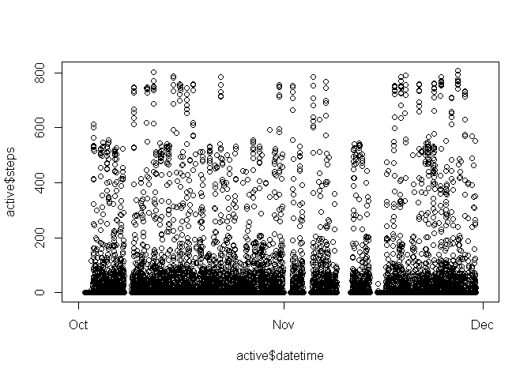
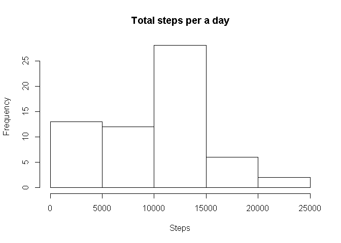
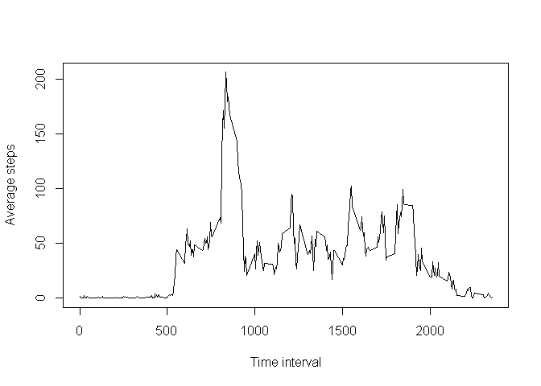
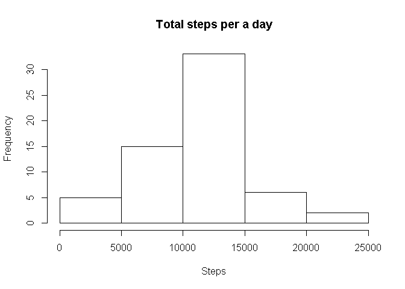
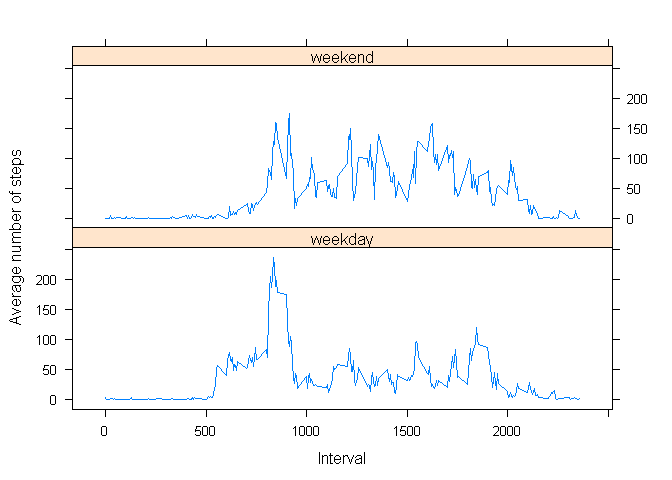

# Reproducible Research: Peer Assessment 1
Henry  
May 27, 2017  


### Purpose
The purpose of this project is to interrogate the fib bit activity monitor data as part of a class project. There are 4 main questions/goals:
1. What is mean total number of steps taken per day?
2. What is the average daily activity pattern?
3. Imputing missing values
4. Are there differences in activity patterns between weekdays and weekends?

### Load the data set


```r
#Get and read file
#download.file("https://d396qusza40orc.cloudfront.net/repdata%2Fdata%2Factivity.zip", "factivity.zip")
unzip(zipfile = "activity.zip")
active<-read.csv("activity.csv")
```

### Exploratory data analysis
The date was processed into a date type.


```r
head(active,15)
```

```
##    steps       date interval
## 1     NA 2012-10-01        0
## 2     NA 2012-10-01        5
## 3     NA 2012-10-01       10
## 4     NA 2012-10-01       15
## 5     NA 2012-10-01       20
## 6     NA 2012-10-01       25
## 7     NA 2012-10-01       30
## 8     NA 2012-10-01       35
## 9     NA 2012-10-01       40
## 10    NA 2012-10-01       45
## 11    NA 2012-10-01       50
## 12    NA 2012-10-01       55
## 13    NA 2012-10-01      100
## 14    NA 2012-10-01      105
## 15    NA 2012-10-01      110
```

```r
dim(active)
```

```
## [1] 17568     3
```

```r
active$date<-as.Date(active$date)
plot(active$steps~active$date)
```

<!-- -->

```r
summary(active$steps)
```

```
##    Min. 1st Qu.  Median    Mean 3rd Qu.    Max.    NA's 
##    0.00    0.00    0.00   37.38   12.00  806.00    2304
```

```r
summary(active$interval)
```

```
##    Min. 1st Qu.  Median    Mean 3rd Qu.    Max. 
##     0.0   588.8  1177.5  1177.5  1766.2  2355.0
```
Based on the above, the data has date, steps taken in the interval, and the interval of the day. I would expect 12 intervals/hour * 24 hours/day = 288 intervals/day. The interval, however, ends at 00 and the next digit is the hour. So it is a time with the ":" and placeholder "0"s missing.


```r
temp<-active$interval
temp<-paste(ifelse(temp<10,"000",ifelse(temp>5&temp<100,"00",ifelse(temp>55&temp<1000,"0",""))),temp,sep="")
active$time<-paste(substr(temp,1,2),substr(temp,3,4),sep=":")
active$datetime<-as.POSIXct(paste(active$date, active$time))
plot(active$steps~active$datetime)
```

<!-- -->
The plot now looks similar, but denser.


```r
grouped <- group_by(active, date)
dailysteps <- summarise(grouped, t_steps = sum(steps, na.rm = TRUE))
hist(dailysteps$t_steps, main="Total steps per a day", xlab="Steps")
```

<!-- -->

```r
print("Average steps per a day",quote = F)
```

```
## [1] Average steps per a day
```

```r
mean(dailysteps$t_steps,na.rm=TRUE)
```

```
## [1] 9354.23
```

```r
print("Median steps per a day",quote = F)
```

```
## [1] Median steps per a day
```

```r
median(dailysteps$t_steps,na.rm=TRUE)
```

```
## [1] 10395
```
Next, we want to know what are the average steps taken at each time interval for all the days. Which interval has the highest average number of steps?


```r
grouped <- group_by(active, interval)
avgsteps <- summarise(grouped, a_steps = mean(steps, na.rm = TRUE))
plot(x = avgsteps$interval,y=avgsteps$a_steps, type = "l",ylab = "Average steps",main="", xlab="Time interval")
```

<!-- -->

```r
avgsteps[which(avgsteps$a_steps==max(avgsteps$a_steps)),]$interval
```

```
## [1] 835
```
Now deal with the missing values. First we need to know how many missing values there are, and if there is a pattern to them.


```r
sum(is.na(active$steps))
```

```
## [1] 2304
```

```r
x<-unique(active[which(is.na(active$steps)),]$date)
8 *288
```

```
## [1] 2304
```

```r
weekdays(x)
```

```
## [1] "Monday"    "Monday"    "Thursday"  "Sunday"    "Friday"    "Saturday" 
## [7] "Wednesday" "Friday"
```
All of the missing values are the entire day, 8 days times 288 intervals. I will impute based on the average steps for each interval by day of the week.

```r
active$dayofweek<-weekdays(active$date)
grouped <- group_by(active, dayofweek, interval)
avgsteps <- summarise(grouped, a_steps = mean(steps, na.rm = TRUE))
df<- spread(avgsteps, dayofweek, a_steps, fill = NA)
Imputes<-df[weekdays(x)]
names(Imputes)<-1:8 #Gather works better with unique column names
Imputes<-gather(Imputes)
active.1<-active
active.1[which(is.na(active.1$steps)),]$steps<-Imputes$value
grouped <- group_by(active.1, date)
dailysteps <- summarise(grouped, t_steps = sum(steps, na.rm = TRUE))
hist(dailysteps$t_steps, main="Total steps per a day", xlab="Steps")
```

<!-- -->

```r
print("Average steps per a day",quote = F)
```

```
## [1] Average steps per a day
```

```r
mean(dailysteps$t_steps,na.rm=TRUE)
```

```
## [1] 10821.21
```

```r
print("Median steps per a day",quote = F)
```

```
## [1] Median steps per a day
```

```r
median(dailysteps$t_steps,na.rm=TRUE)
```

```
## [1] 11015
```
The average and median steps per a day are higher in the dataset with imputation performed.
Based on a comparison the historgrams, we see that the 8 days with missing values contibuted had total steps of 0, and this weighted the 0-5000 steps bin of the histogram. Following imputation, the historgam looks normally distributed. Imputing yields a more realisitc estimate of the total steps per day.


```r
active.1$weekday<-as.factor(ifelse(active.1$dayofweek%in%c("Monday","Tuesday","Wednesday","Thursday","Friday"),
                         "weekday","weekend"))
grouped <- group_by(active.1, weekday, interval)
avgsteps <- summarise(grouped, a_steps = mean(steps))
xyplot(a_steps~interval|weekday,type='l',layout=c(1,2),data=avgsteps, xlab="Interval",ylab="Average number of steps")
```

<!-- -->
